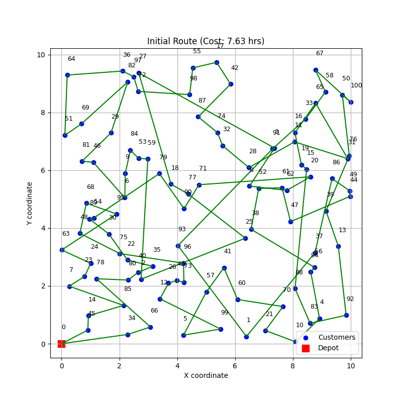
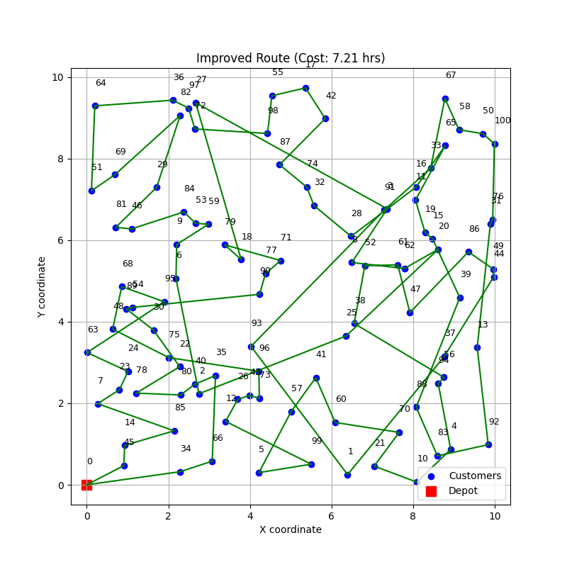

# TSPTW 近似解法 (挿入法 + 2-opt)

## 概要

このコード群は、時間制約付き巡回セールスマン問題（TSPTW）に対する近似解法を実装したものである。
目的は、単一のデポ（拠点）から出発し、設定された時間枠（タイムウィンドウ）を守りながら全ての配送先を訪問し、デポへ戻るルートの中で、総移動時間が最短となる経路を見つけることにある。

## 問題設定

TSPTW は、古典的な巡回セールスマン問題に対し、各訪問先ごとに訪問可能な時間帯（タイムウィンドウ）制約を追加した問題である。

## 採用アルゴリズム

本実装では、高速に実行可能な解を求めるため、構築ヒューリスティクスと改善ヒューリスティクスを組み合わせたアプローチを採用している。

### 初期経路構築：挿入法 (Insertion Heuristic)

まず、デポと最初の訪問先（例：デポから最も遠い地点）からなる単純な往復経路を作成する。次に、まだ経路に含まれていない訪問先の中から一つを選択し、現在の経路上の辺（二つの連続する訪問先の間）すべてについて、その間に選択した訪問先を挿入した場合のコスト増加分（追加移動時間）を計算する。同時に、挿入後の経路全体が時間枠制約を満たすかを確認する。時間枠制約を満たす挿入位置の中で、コスト増加が最小となる位置に実際に挿入を行う。これを全ての訪問先が経路に含まれるまで繰り返すことで、実行可能な初期解を高速に構築する。

### 経路改善：2-opt 局所探索 (Local Search)

挿入法で得られた初期経路に対して、さらなる改善を試みる。2-opt は局所探索の一種であり、現在の経路から 2 つの辺を選択し、それらを交差しないように繋ぎ変える操作を行う（これにより、2 辺間の経路セグメントが逆順になる）。この組み換え操作によって生成された新しい経路の総移動時間を計算し、時間枠制約を満たすかを確認する。もし制約を満たし、かつ総移動時間が元の経路より短縮されていれば、新しい経路を採用する。このプロセスを、改善が見られなくなるまで、あるいは規定の反復回数に達するまで繰り返すことで、解の質を高める。

## アルゴリズム選択の背景

このアルゴリズム選択の主な理由は、計算速度と実用性のバランスを考慮した結果である。

以前の検討において、遺伝的アルゴリズム（GA）のようなメタヒューリスティクスを用いた場合、解の品質は高くなる可能性がある一方で、満足のいく解を得るまでに数分から十数分といった計算時間を要することがわかった。

応答性が求められるアプリケーション（例：配送計画ツールなど）への組み込みを想定した場合、この計算時間は許容し難い場合がある。そのため、本実装では解の最適性において多少譲歩しても、より短時間（目標として数秒～数十秒程度）で実用的な解を提供できることを優先した。

この目標を達成するために、高速に初期解を生成できる挿入法と、比較的軽量でありながら一定の改善効果が期待できる 2-opt 局所探索を組み合わせるという、確立されたヒューリスティック手法を選択した。

## 実行方法

`main.py` スクリプトを実行することで、デモンストレーションを開始できる。

```bash
python -m src.insertion_and_2opt.main
```

配送先の数 (`N`)、配送エリアのサイズ (`W`, `H`)、車両の移動速度 (`V`) といった主要な設定値は、`main.py` ファイルの冒頭部分で編集することが可能である。

### 実行例

```bash
❯ time python3 -m src.insertion_and_2opt.main
--- 1. Generating Input Data ---
Locations: 100, Area: 10.0x10.0, Speed: 20.0 km/h, Seed: 42
Generated 100 locations and time windows in 0.0005 seconds.

--- 2. Building Initial Route (Insertion Heuristic) ---
Initial route built in 0.4603 seconds.
Initial Route: [0, 34, 66, 78, 80, 40, 35, 22, 30, 89, 54, 79, 90, 71, 20, 62, 8, 3, 27, 18, 77, 25, 2, 59, 53, 84, 9, 6, 46, 81, 29, 82, 69, 51, 64, 36, 97, 72, 98, 55, 17, 42, 87, 74, 32, 28, 11, 31, 65, 16, 19, 15, 88, 83, 92, 13, 39, 76, 50, 100, 67, 58, 33, 91, 93, 1, 37, 86, 49, 44, 47, 61, 52, 38, 56, 94, 4, 10, 21, 70, 60, 41, 57, 5, 99, 12, 26, 43, 73, 96, 75, 48, 68, 95, 63, 24, 23, 7, 85, 14, 45, 0]
Feasible: True
Cost (Total Travel Time): 7.63 hours (457.75 minutes)

--- 3. Improving Route (Local Search 2-opt) ---
Local Search starting with cost: 457.75
Local Search finished after 20 iterations. Final cost: 432.55
Local search completed in 1.8941 seconds.
Improved Route: [0, 34, 66, 35, 40, 80, 78, 22, 30, 89, 54, 90, 77, 71, 79, 18, 27, 3, 8, 62, 20, 25, 2, 6, 9, 59, 53, 84, 46, 81, 29, 82, 69, 51, 64, 36, 97, 72, 98, 55, 17, 42, 87, 74, 32, 28, 16, 65, 11, 19, 15, 39, 88, 83, 92, 13, 31, 76, 100, 50, 58, 67, 33, 91, 93, 1, 37, 44, 49, 86, 47, 61, 52, 38, 56, 94, 4, 10, 21, 70, 60, 41, 57, 5, 99, 12, 26, 43, 73, 96, 75, 48, 68, 95, 63, 24, 23, 7, 85, 14, 45, 0]
Feasible: True
Cost (Total Travel Time): 7.21 hours (432.55 minutes)

Improvement: 0.42 hours (25.21 minutes) (5.51%)
python3 -m src.insertion_and_2opt.main  2.37s user 0.01s system 99% cpu 2.390 total
```

#### 挿入法により構築された初期経路



#### 2-opt により改善された経路


